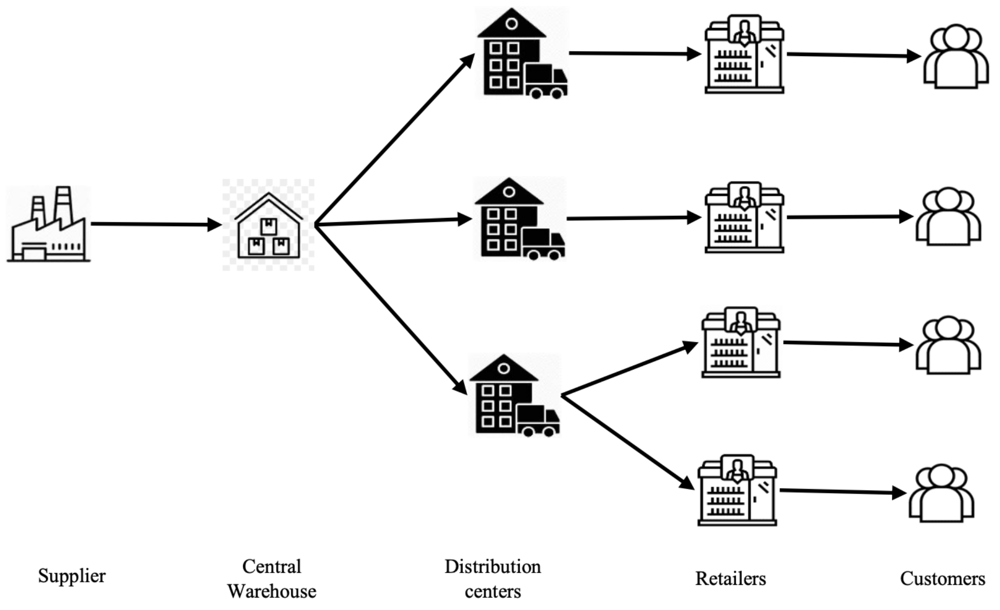

# Deep Reinforcement Learning for Multi-Echelon Inventory Optimization




Inventory Optimization is a critical problem in supply chain systems, where traditional heuristics such as [(s, S)](https://hub.spreadsheetweb.com/templates/view/s-s-inventory-model#:~:text=The%20s%2DS%20inventory%20policy%20analysis,stockouts%20and%20minimizing%20inventory%20expenses) policies struggle under stochastic demand, lead time variability, and multi-echelon dependencies.

This project demonstrates how **Deep Reinforcement Learning (DRL)** can learn adaptive invetory control policies that optimize long-term cost and service level trade-offs.

## Problem Formulation

We model the system as a **Markov Decision Process (MDP)**:
- **State (s)**: Inventory levels, pipeline stock, demand signals
- **Action (a)**: Replenishment quantities
- **Reward (r)**: Negative total cost
- **Transition**: Inventory dynamics + stochastic demand

### Objective

Minimize expected cumulative cost: 
$$J(\pi) = \mathbb{E} \left[ \sum_{t=0}^{T} \gamma^t C(s_t, a_t) \right]$$

## Algorithms Implemented

### Asynchronous Advantage Actor-Critic ([A3C](https://medium.com/sciforce/reinforcement-learning-and-asynchronous-actor-critic-agent-a3c-algorithm-explained-f0f3146a14ab))

- Parallel actor-learners
- Advantage-based updates
- Stable and efficient training

### Proximal Policy Optimization ([PPO](https://en.wikipedia.org/wiki/Proximal_policy_optimization))

- Clipped objective for stability
- Generalized Advantage Estimation (GAE)
- Strong emperical performance

### Baseline: (s, S) policy

Classical inventory heuristic used as benchmark

## Results Summary

| Model | Key Results |
| ----- | ----------- |
| (s, S) | Strong baseline |
| A3C | 1.5% cost improvement |
| PPO | 33% cost reduction |

# Project Structure

```
.multi-echelon-rl-inventory
├──actor-critic/
|   ├── configs/
│   |   ├── config.yaml
│   |   └── meisConfig.yaml
|   ├── src/
│   |   ├── __init__.py
│   |   ├── a3c_agent.py
│   |   ├── meis_env.py
│   |   ├── s_s_policy.py
│   |   └── trainer.py
|   ├── utils/
│   |   ├── __init__.py
│   |   ├── evaluation.py
│   |   ├── helpers.py
│   |   └── visualisation.py
|   ├── results/
│   |   ├── checkpoints/
│   |   ├── logs/
│   |   └── plots/
│   ├── main.py
|   └── README.md
├──ppo/
|   ├── configs/
│   |   └── config.yaml
|   ├── models/
│   |   ├── __init__.py
│   |   ├── actor_critic.py
│   |   ├── baseline.py
│   |   ├── env.py
│   |   ├── replay_buffer.py
│   |   └── ppo.py
|   ├── src/
│   |   ├── __init__.py
│   |   ├── train.py
│   |   ├── evaluate.py
│   |   └── visualise.py
|   ├── utils/
│   |   ├── metrics.py
│   |   ├── logger.py
│   |   └── helpers.py
|   ├── results/
│   |   ├── checkpoints/
│   |   ├── logs/
│   |   ├── plots/
│   |   ├── evaluation_results.json
│   |   └── training_stats.json
│   ├── main.py
|   └── README.md
├── .gitignore
├── README.md
└── requirements.txt
```

# Setup and Execution

```bash
python3 -m venv .venv           # initialise virtual environment
source .venv/bin/activate       # activate virtual environment
pip install -r requirements.txt # install all required dependencies
```

## Run A3C

``` bash
cd actor-critic
python3 main.py --mode train    # train agent
python3 main.py --mode eval     # evaluate performance against baseline
python3 main.py --mode plot     # visualise training curves and evaluation results
```

## Run PPO

``` bash
cd ppo
python3 main.py --mode train    # train agent
python3 main.py --mode eval     # evaluate performance against baseline
python3 main.py --mode plot     # visualise training curves and evaluation results
```

# Platform Independence

This project runs on multiple operating systems and hardware backends with no code changes required.

## Operating System

| OS | Supported | Notes |
| -- | --------- | ----- |
| macOS | ✅ | Intel and Apple Silicon (M1 / M2 / M3) |
| Windows | ✅ | Windows 10 / 11 |
| Linux | ✅ | Recommended for multi-process A3C training |

### Virtual Environment Setup

**macOS / Linux**:
```bash
python3 -m venv .venv
source .venv/bin/activate
pip install -r requirements.txt
```

**Windows (PowerShell)**:
```powershell
python -m venv .venv
.\.venv\Scripts\Activate.ps1
pip install -r requirements.txt
```

**Windows (Command Prompt)**:
```cmd
python -m venv .venv
.venv\Scripts\activate.bat
pip install -r requirements.txt
```

> On Windows, if script execution is blocked run: `Set-ExecutionPolicy -Scope CurrentUser RemoteSigned`

## Hardware / GPU

PyTorch auto-detects the best available device at runtime — no manual configuration needed.

| Backend | Hardware | Auto-selected when |
| ------- | -------- | ------------------ |
| CUDA | NVIDIA GPU | `torch.cuda.is_available()` returns `True` |
| MPS | Apple Silicon (M1 / M2 / M3) | `torch.backends.mps.is_available()` returns `True` |
| CPU | Any machine | Fallback if neither CUDA nor MPS is available |

> **CUDA users**: install the CUDA-enabled PyTorch wheel that matches your driver *before* running `pip install -r requirements.txt`. See [pytorch.org/get-started](https://pytorch.org/get-started/locally/) for the correct install command.

## Python Version

Requires **Python 3.8+**. Recommended: **Python 3.10** or **3.11**.