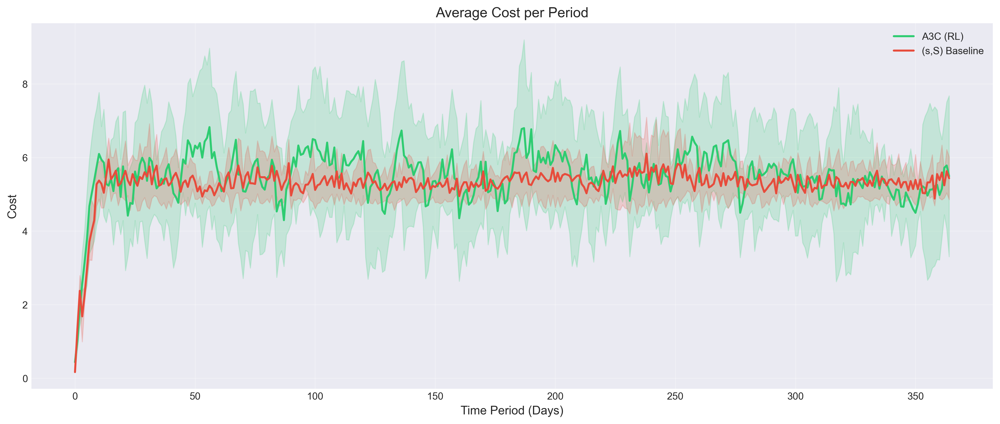
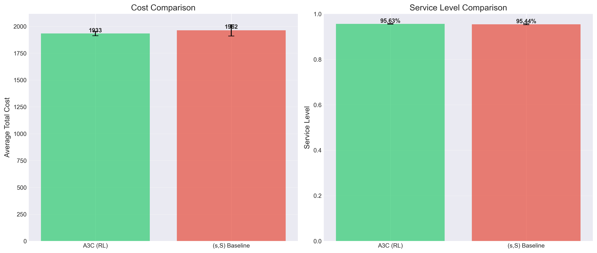

# A3C for Inventory Optimization (MEIS Environment)

Implementation of **Asynchronous Advantage Actor-Critic** for inventory optimization in a stochastic multi-echelon supply chain environment as defined in this [research paper](https://link.springer.com/article/10.1007/s10100-023-00872-2).

## Problem Statement

Modern supply chains face stochastic demand, lead times, and cost trade-offs, making inventory optimization a challenging sequential decision problem. The challenge lies in:

- Uncertain demand patterns
- Trade off between holding, ordering, and stockout costs
- Temporal dependencies (decisions affect future states)
- Balancing cost vs service level

We aim to:

> Minimise total inventory cost while maintaining high service levels

## Architecture

1. **Actor Network (Policy π)**
- Outputs probablility distribution over actions
- Learns what action to take

2. **Critic Network (Value Function V)**
- Estimates expected return from a state
- Helps reduce variance in training

3. **Environment (Custom MEIS environment)**
- Demand randomness
- Inventory levels
- Cost structure

Architecture configurations controlled via: `configs/config.yaml`

Environment settings defined in: `configs/meisConfig.yaml`

Key tunables:
* Learning Rate
* Discount Factor
* Entropy Regularization
* Episode Length

## RL Formulation

**Advantage Function**:

$$
A(s_t, a_t) = R_t - V(s_t)
$$

**Actor loss function (Policy Gradient)**

$$
Loss_{actor} = -\log\pi_{\theta}(a_t | s_t) \cdot A(s_t, a_t)
$$

**Critic loss function (Value Function)**

$$
Loss_{critic} = (R_t - V(s_t))^2
$$

**Total Loss**:

$$
L = Loss_{actor} + \lambda Loss_{critic}
$$


## Results

> **A3C achieves a 1.5% cost reduction and a 2.5× improvement in cost consistency over the (s, S) baseline — both statistically significant (p < 0.001) across 1,000 evaluation episodes.**

### Performance Comparison

| Metric | A3C (RL) | (s, S) Baseline | Improvement |
| ------ | -------- | --------------- | ----------- |
| Avg Cost | **1,932.85** | 1,962.40 | ↓ 1.51% (~30 units/episode) |
| Cost Std Dev | **20.63** | 52.39 | ↓ 2.54× more consistent |
| Service Level | **95.63%** | 95.44% | ↑ +0.19 pp |
| Service Level Std Dev | **0.13%** | 0.20% | ↓ more stable |

### Cost Breakdown (cumulative over 1,000 episodes)

| Cost Component | A3C (RL) | (s, S) Baseline | Change |
| -------------- | -------- | --------------- | ------ |
| Shortage | 16,714,989 | 18,160,470 | ↓ **8.0%** |
| Holding | 1,205,612 | 163,967 | ↑ 7.4× (deliberate buffer) |
| Reordering | 1,220,996 | 1,237,604 | ↓ 1.3% |

> The A3C agent learns to hold more inventory (higher holding cost) in exchange for dramatically fewer stockout events — a smart trade-off since shortage penalties dominate total cost.

### Statistical Significance

Both improvements are **extremely statistically significant** (evaluated over 1,000 episodes):

| Test | t-statistic | p-value | Cohen's d |
| ---- | ----------- | ------- | --------- |
| Cost reduction | −16.59 | < 0.001 | **0.74** (medium-large effect) |
| Service level | +25.25 | < 0.001 | — |

### Key Takeaways

- **Cost efficiency**: ~30 units lower average cost per episode vs the classical heuristic
- **Reliability**: 2.5× lower cost variance — far more predictable performance, critical in real supply chains
- **Stockout reduction**: 8% fewer shortage events by intelligently maintaining higher safety stock
- **Adaptive policy**: dynamically adjusts ordering decisions to demand variability across all echelons, unlike the static (s, S) rule





## Training Stability

* Converges after 4K–5K episodes
* Cost std dev drops from ~52 (baseline) to ~21 (A3C) — critic guidance suppresses variance
* Stable, consistent policy post-convergence across random seeds

## Execution Steps

``` bash
cd actor-critic
python3 main.py --mode train    # train agent
python3 main.py --mode eval     # evaluate performance against baseline
python3 main.py --mode plot     # visualise training curves and evaluation results
```