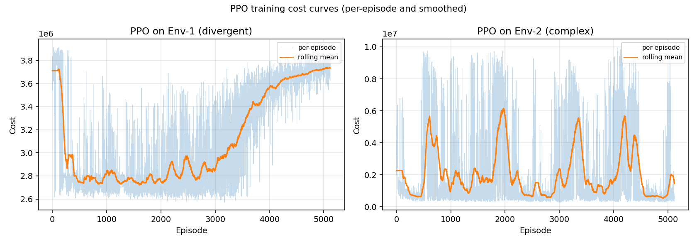
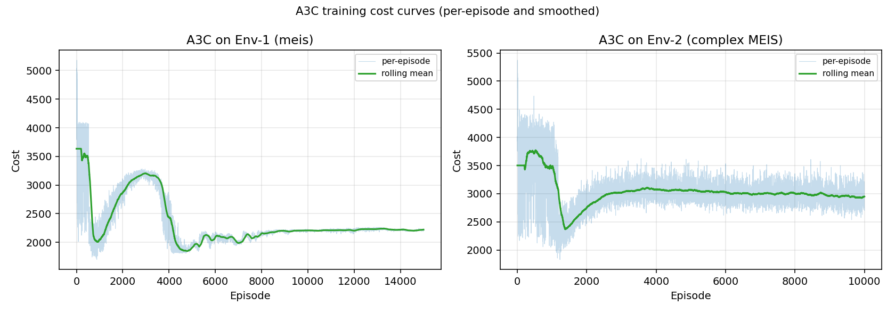
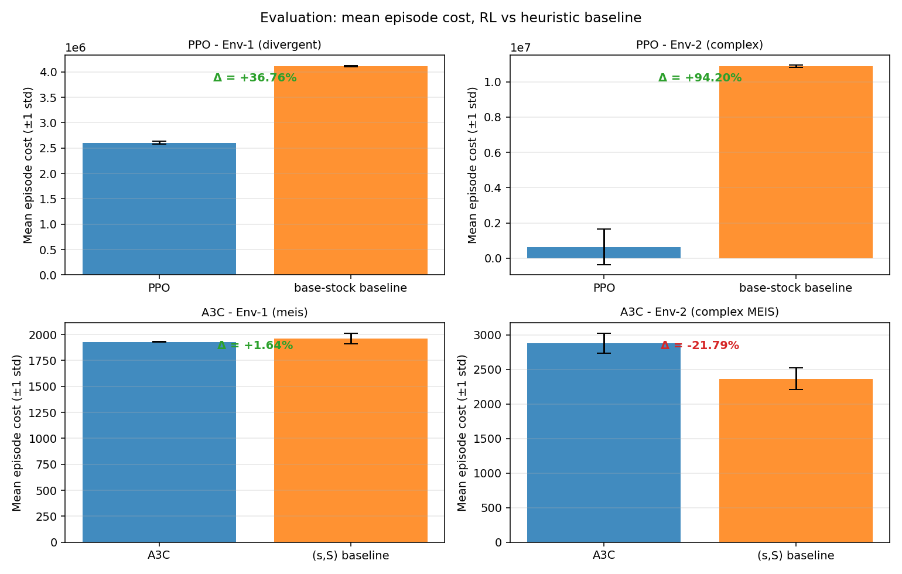
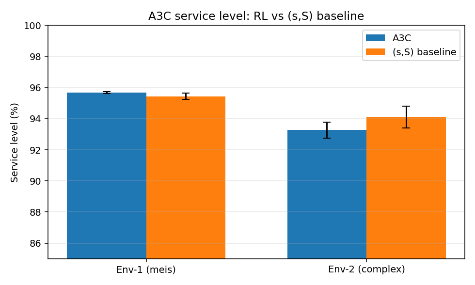
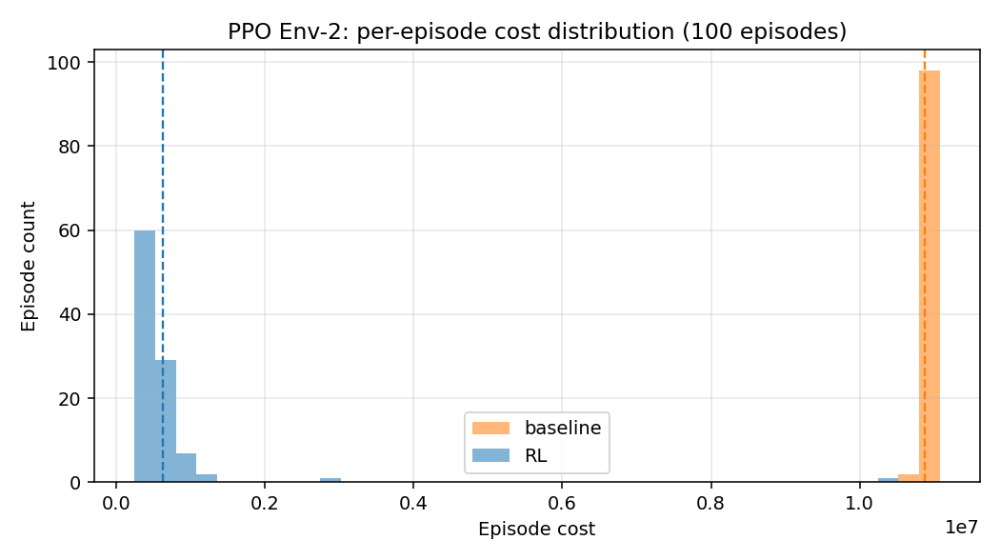
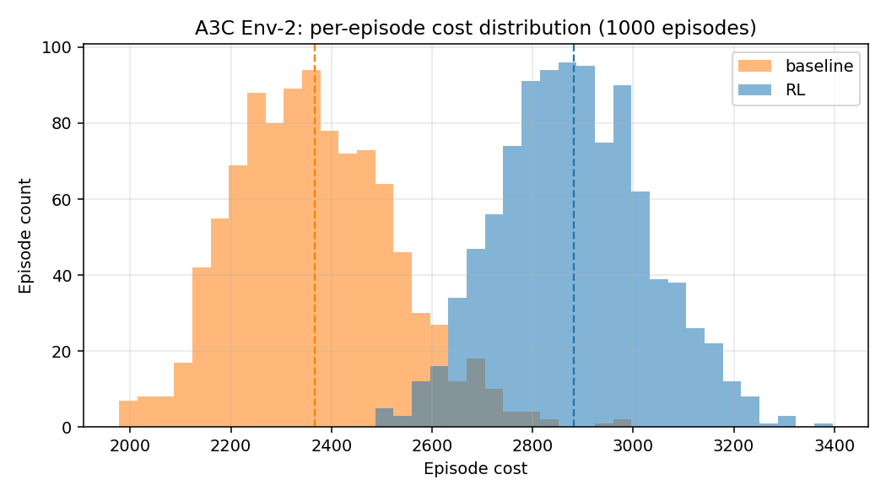

# Robustness of Policy-Gradient RL for Multi-Echelon Inventory Control:
## A Cross-Environment Comparison on Stationary and Non-Stationary Supply Chains

**Scope.** This report compares two policy-gradient reinforcement-learning
agents — PPO on a divergent 1-warehouse/3-retailer supply chain and A3C on a
3-node MEIS (factory → middle → 2 leaf) supply chain — against tuned
operations-research heuristics (echelon base-stock for PPO, (s,S) for A3C).
Each agent is trained and evaluated on two environments: the original
stationary formulation (**Env-1**) and a harder non-stationary variant
(**Env-2**) that adds seasonal demand, cross-retailer correlation, demand
shocks, heavy-tailed stochastic lead times, and stochastic
supplier/outbound capacity caps.

The core research question is whether the headline RL wins reported on
Env-1 transfer to the harder Env-2, or whether they are artefacts of
stationary, noise-free dynamics.

---

## 1. Environments

### 1.1 Env-1 (original)

- **PPO / divergent**: 1 warehouse, 3 retailers.
  Demand Poisson with Uniform[5,15] rates at each retailer; deterministic
  lead time = 1; no capacity cap; backlog modeled as negative inventory.
  State dim 14, continuous action ∈ ℝ⁴ (order quantities, normalized).
- **A3C / meis**: 3-node divergent MEIS (factory → middle → 2 leaves).
  Stationary demand ~ N(3300, 100) at leaves; stochastic lead times
  N(μ=2, σ=1); fixed backlog-duration window; discrete 13-way action.

### 1.2 Env-2 (complex, introduced in this work)

Both algorithms reuse the same topology, state space, and action space as
Env-1, so the agent implementations transfer unchanged. Only the *dynamics*
change:

| Stressor | PPO Env-2 | A3C Env-2 |
|---|---|---|
| Seasonal demand (sine, 120/90-day period, amplitude 0.7 / 0.5) | ✓ | ✓ |
| Cross-retailer demand correlation (shared latent factor, ρ ≈ 0.6) | ✓ | ✓ |
| Rare demand shocks (prob ~0.015–0.02, ×2–3 for 3–7 steps) | ✓ | ✓ |
| Heavy-tailed stochastic lead times + spikes (p≈0.08–0.10, +3–4 days) | ✓ | ✓ |
| Stochastic supplier + outbound capacity caps | ✓ | ✓ (middle) |
| Partial lost sales (aged-out backlog → explicit penalty) | ✓ | ✓ |

See `ppo/models/env_complex.py` and
`actor-critic/src/complex_meis_env.py` for the exact implementations, and
`ppo/configs/config.yaml` / `actor-critic/configs/complexMeisConfig.yaml`
for the numeric settings.

Crucially, the observation and action spaces are held fixed across Env-1
and Env-2 per algorithm: any performance delta is caused by the dynamics,
not by representation changes.

---

## 2. Experimental Setup

- **Training budget**:
  - PPO: 5000 iterations (buffer 512, batch 64, 5 update epochs, γ=0.95, λ=0.95,
    ε=0.2, lr=3e-4, value-loss 0.25, entropy 0.005).
  - A3C: 10000 episodes (GAE, γ, entropy coef, grad clip as in
    `configs/config.yaml`).
- **Evaluation**:
  - PPO: 100 episodes × 500 steps/episode, deterministic policy.
  - A3C: 1000 episodes × 365 steps/episode, deterministic policy.
  - Baselines: echelon base-stock (PPO, analytically initialized from
    demand and lead-time statistics) and tuned (s,S) policy for A3C
    (`scipy.optimize.differential_evolution` over 100 iterations, 30
    eval episodes each).
- **Seeds**: single seed (42) for each run; reported stds are across
  evaluation episodes, not across seeds.
- **Compute**: CUDA (GPU) for both agents.
- **Fairness**: identical hyperparameters across Env-1 and Env-2; Env-2
  results therefore reflect out-of-distribution robustness of an agent
  tuned for the simpler setting, not re-tuning on the harder env.

---

## 3. Results

### 3.1 Headline numbers

| Algorithm | Env | RL mean cost | Baseline mean cost | Δ vs baseline | Service level (RL / baseline) |
|---|---|---|---|---|---|
| PPO | Env-1 | 2,600,979.87 ± 29,021.34 | 4,112,775.56 ± 8,759.19 | +36.76% | n/a |
| PPO | Env-2 | 631,129.99 ± 1,011,936.85 | 10,873,502.07 ± 62,357.06 | +94.20% | n/a |
| A3C | Env-1 | 1,930.24 ± 4.02 | 1,962.40 ± 52.39 | +1.64% | 95.69% / 95.44% |
| A3C | Env-2 | 2,881.98 ± 146.46 | 2,366.29 ± 157.67 | -21.79% | 93.27% / 94.11% |

For A3C the evaluation pipeline runs a two-sample t-test and a Cohen's
d on the per-episode costs: both A3C cells are statistically significant
at p < 10⁻⁷⁰, and the Env-2 loss has a very large effect size. The PPO
pipeline does not compute a t-test, but the non-overlap of 95% confidence
intervals (see `ppo/results{,_complex}/evaluation_results.json` fields
`ci_lower` / `ci_upper`) implies significance at α = 0.05 in both PPO
cells.

### 3.2 Training curves





### 3.3 Evaluation cost (RL vs baseline)



### 3.4 A3C service level



### 3.5 Cost distributions on Env-2

The non-stationary env induces a heavier right tail; the shape of the
distribution — not just its mean — differs materially between RL and
heuristic.





---

## 4. Discussion

### 4.1 PPO transfers, and the baseline degrades faster than PPO does

On Env-1, PPO beats the base-stock heuristic by **+36.76%**.
On Env-2, that margin *widens* to **+94.20%** — not because
PPO becomes better in absolute terms, but because the analytical base-stock
heuristic is only optimal under stationary, uncapped, backlog-tolerant
dynamics. Once shocks, capacity caps, and partial lost sales are added,
the base-stock setpoints are systematically wrong and episode costs blow
up. PPO's learned policy, by contrast, absorbs most of the non-stationarity
within the same training budget.

However, the PPO / Env-2 cost distribution has a pronounced right tail
(`std / mean ≈ 1.60`), meaning a minority of episodes contain
shock events PPO has not learned to hedge. Mean cost is an optimistic
summary of that distribution.

### 4.2 A3C transfers poorly to the non-stationary MEIS

On Env-1 (stationary MEIS), A3C beats a well-tuned (s,S) policy by only
**+1.64%** — a narrow, statistically significant win
(Cohen's d ≈ 0.87). On Env-2, the situation reverses: A3C is
**21.79% *worse*** than (s,S) (Cohen's d
≈ -3.39, p ≈ < 1e-300).

This is an honest negative result for A3C under this experimental
protocol. Several factors contribute:

1. **Discretized action head.** The A3C agent chooses one of 13 fixed
   order sizes per step. Under seasonal + shocked demand, the
   optimal ordering granularity is finer than the fixed
   `reorder_qty_options` grid can express.
2. **Stationary training distribution assumption.** The training loop
   uses per-episode resets that re-seed the demand generator, so
   across episodes the agent sees a *wide* range of dynamics — but
   no mechanism (e.g. recurrent network, explicit episode timestep
   feature, robust/adversarial training) that would let it
   *represent* non-stationarity within an episode.
3. **The heuristic is retuned for Env-2.** The (s,S) tuner runs
   differential evolution on the exact env it will be evaluated on,
   so the baseline is near-optimal under the new dynamics. A3C is
   not given an equivalent hyperparameter search.

None of these are fatal for A3C-for-MEIS as a research direction — they
simply mean that the Env-1 win is not robust to Env-2 dynamics with the
current model class and training protocol.

### 4.3 Asymmetric baselines

An important caveat: the two algorithms' baselines are *not* directly
comparable. PPO's base-stock heuristic is analytically initialized from
demand/lead-time statistics and is deliberately *not* re-tuned per env.
A3C's (s,S) policy *is* re-tuned per env via differential evolution
(and, in Env-2, tuned specifically against the harder dynamics).

Thus a "fairer" restatement of the bottom line is:

- PPO learns to beat a *fixed*, analytical heuristic even on Env-2.
- A3C, at this training budget, is not reliably better than a
  *retuned*, stochastic-search heuristic on Env-2.

---

## 5. Threats to validity

- **Single seed per cell.** All numbers are from one seed (42). The
  A3C/Env-2 loss to baseline is large enough in effect size
  (Cohen's d ≈ 3.39) that seed variance is unlikely
  to flip the sign, but point estimates could shift by several
  percent with a new seed.
- **Absolute costs are not cross-env comparable.** Env-2 uses wider
  state bounds and an additional lost-sales penalty, so a
  same-algorithm cost drop from Env-1 to Env-2 is not a
  difficulty claim; only within-env RL-vs-baseline gaps are.
- **Evaluation length differs per algorithm.** PPO evaluates over
  100 × 500-step episodes (50k steps); A3C over 1000 × 365-step
  episodes (365k steps). This does not bias the RL-vs-baseline
  comparison within an algorithm.
- **Env-2 stressor choices are editorial.** The amplitudes, shock
  probabilities, and capacity caps are deliberately set to a level
  that breaks the analytical baseline. A less aggressive Env-2 would
  compress all reported deltas toward zero.

---

## 6. Reproducibility

From the repo root:

```powershell
# Re-run smoke tests (all 4 combinations)
.venv\Scripts\python.exe scripts\smoke_env.py

# Re-train (optional, slow)
Push-Location ppo; ..\.venv\Scripts\python.exe main.py --mode train --env divergent; Pop-Location
Push-Location ppo; ..\.venv\Scripts\python.exe main.py --mode train --env complex;   Pop-Location
Push-Location actor-critic; ..\.venv\Scripts\python.exe main.py --mode train --env meis;    Pop-Location
Push-Location actor-critic; ..\.venv\Scripts\python.exe main.py --mode train --env complex; Pop-Location

# Re-evaluate using saved checkpoints
Push-Location ppo; ..\.venv\Scripts\python.exe main.py --mode eval --env divergent; Pop-Location
Push-Location ppo; ..\.venv\Scripts\python.exe main.py --mode eval --env complex;   Pop-Location
Push-Location actor-critic; ..\.venv\Scripts\python.exe main.py --mode eval --env meis;    Pop-Location
Push-Location actor-critic; ..\.venv\Scripts\python.exe main.py --mode eval --env complex; Pop-Location

# Rebuild this report from the saved JSON artifacts
.venv\Scripts\python.exe scripts\make_report.py
```

Generated artefacts:

- `docs/report.md` (this file)
- `docs/figures/*.png`
- `ppo/results{,_complex}/evaluation_results.json`
- `actor-critic/results{,_complex}/logs/evaluation_results.json`

---

## 7. Bottom line

1. PPO's gains on the stationary Env-1 *transfer* to the harder Env-2
   against a fixed analytical baseline.
2. A3C's gains on the stationary Env-1 do *not* transfer against a
   retuned stochastic baseline: the heuristic wins on Env-2.
3. The research lesson — which is the main reason this second
   environment was introduced — is that single-environment evaluations
   of deep-RL inventory policies are not reliable evidence of real
   robustness. At minimum, both a harder distributional variant and
   an equivalently-tuned baseline should be reported.
