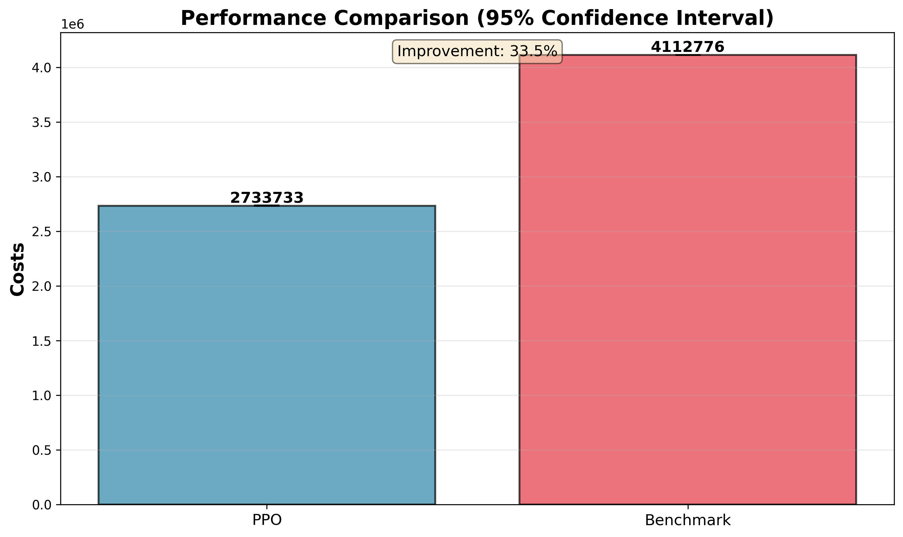

# PPO for divergent Multi-Echelon Inventory Optimization

Implementation of **Proximal Policy Optimization** for **Cost-Efficient** Supply Chain Control as defined in this [paper](https://link.springer.com/article/10.1007/s10100-023-00872-2).

## Problem Statement

Modern supply chains involve **multi-echelon inventory systems** where a central warehouse distributes goods to three retailers. The challenge lies in:

- Handling stochastic demand
- Managing inventory holding costs vs shortage penalties
- Making sequential ordering decisions under uncertainty

> We aim to learn an optimal policy 𝜋(𝑎∣𝑠) that minimizes total operational cost

$$
min\ E\left[\sum_{t=0}^{T}(C_{holding} + C_{backorder} + C_{ordering})\right]
$$

## Architecture

We use a shared backbone with two separate heads:
* Actor (Policy Network): outputs action distribution $\pi_{\theta}(a|s)$
* Critic (Value Network): estimates state value $V_{\phi}(s)$

Enables **low-variance** policy updates and stable convergence

Architecture configurations defined in: `configs/config.yaml`

Tunables:
- Learning rate
- Discount factor
- GAE
- Clip epsilon
- Batch size
- Buffer size
- Update epochs

## RL Formulation

**Objective Function** ([Clipped Surrogate Objective Function](https://campus.datacamp.com/courses/deep-reinforcement-learning-in-python/proximal-policy-optimization-and-drl-tips?ex=3)):

$$
L^{CLIP}(\theta) = E\left[\min\left(r_{t}(\theta)A_{t}, clip(r_{t}(\theta), 1-\epsilon, 1+\epsilon)A_t\right)\right]
$$

**Value Loss**:

$$
L^{VF} = E\left[(V(s_{t}) - R_t)^2\right]
$$

**Entropy Bonus**:

$$
L^{ENT} = E\left[H(\pi(\cdot|s_t))\right]
$$

**Total Loss**: 

$$
L = L^{CLIP} + c_1 L^{VF} + c_2 L^{ENT}
$$

**Advantage Estimation** (reduce variance):

$$
\delta_t = r_t + \gamma V(s_{t+1}) - V(s_t)
$$

$$
A_t = \delta_t + \gamma\lambda\delta_{t+1} + \cdots
$$

## Results

### Trade-off insights

| Metric | PPO | (s, S) baseline |
| ------ | --- | --------------- |
| Avg cost | 2.73 M | 4.1 M |
| Std Dev | 25K | 8.7K |
| 95% CI | [2.728M, 2.738M] | [4.110M, 4.114M] |
| Reward | -273 | -411 |
| Service Level | 99% | 95% |
| Avg. Order Quantity | 2.6 | 14 |
| Cost Improvement | 33.5% | -- |



### Training Stability

* Converges after ~1K episodes
* Reduced variance due to critic guidance
* Stable policy after convergence
* Consistent generalization across seeds

## Execution Steps

``` bash
cd ppo
python3 main.py --mode train    # train agent
python3 main.py --mode eval     # evaluate performance against baseline
python3 main.py --mode plot     # visualise training curves and evaluation results
```